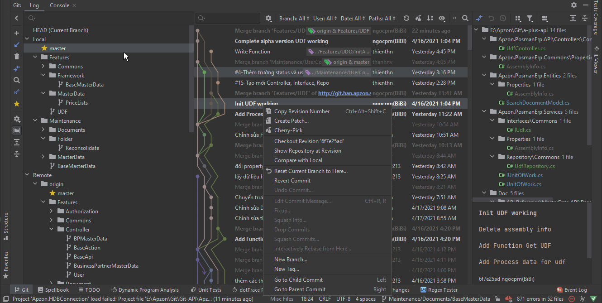

# A-PLUS-API
## Làm ơn... hãy đọc cái này trước khi bắt đầu! 
(Các leader bận lắm nên không có nhiều thời gian giải thích cho các ông đâu hihi!)

## **I. Clone project:**  
### Set up project bằng nuget nếu chưa có: 
> Package references (API):
- Swashbuckle.AspNetCode  -  (lastest)
- System.Runtime.Caching - (5.0.0)
- Dapper - (2.0.78)
- Microsoft.CSharp - (4.7.0)
> Project references:
- API - (.NET 5)
- Commons - (.NET 5)
- Entities - (.NET 5)
- Services - (.NET 5)
> Database references
- PostgreSQL - (13)
## **II. IDE**
>**Visual studio 2019 Developer** (Recommend)

PS: Bác nào cài được **Resharper** cho visual studio thì em hoan nghênh ạ. 
- Check lỗi bằng dynamic program analysis khá là tiện
- dotPeak, dotCover, dotTrace, dotMemory khá tuyệt vời (mỗi tội không dùng đến nhiều) 
- Refactor code dễ dàng
- 1400+ gợi ý (intellisence)
  Điểm trừ duy nhất là khởi động khá lâu và ngốn ram như chrome


>**Jetbrains Rider** (optional)
- cross platforms (hoạt động .NET core mạnh mẽ)
- tích hợp resharper, DataGrips và terminal
- 1450+ gợi ý (intellisence)
- Mất tiền (đa số anh em crack 19)
- Hơi ngốn ram - bù lại performance cực tốt
- Nhiều feature hay ho nhưng không biết dùng để làm gì (nghe có vẻ vô lý nhưng cực kỳ thuyết phục)
- Quản lý source tốt, hỗ trợ merge và rebase ảo diệu



> **PgAdmin v5** (Recommended) để làm việc với cơ sở dữ liệu 

> **DataGrip**, **Azure Data Studio** cũng tương tự PgAdmin (nhưng có intellisense hỗ trợ code, bớt tù)

> **Postman** (Recommended) dùng để test request cho api

> **SourceTree** (Recommended) quản lý source code trên git

### Tham khảo thêm
```
dotnet core: https://docs.microsoft.com/en-us/dotnet/
postgreSQL 13: https://www.postgresql.org/docs/13/index.html
pgAdmin 5: https://www.pgadmin.org/download/
postman: https://www.postman.com/downloads/
```
## **III. Code Convention**
#### C#


**1. API**
- Tên interface: viết theo định dạng chuẩn của C#.
```
vd: ISomeInterface, IDoingSomething
```

- Tên class, Tên function: theo dạng "PascalCase" viết hoa chữ cái đầu tiên và những chữ cái đầu của mỗi từ định danh đằng sau. 
```
vd: SomeClassDoSomething, SomeFunctionHere, ...
```
- Tên biến viết theo dạng "camelCase" viết thường chữ cái đầu tiên và viết hoa những chữ cái đầu của mỗi từ định danh đằng sau.
```
vd: someValue, isOnline, dtResult, ... 
```
- Tên các thuộc tính của object request đến server: viết thường tất cả các chữ cái và các từ nối nhau bởi dấu _, còn lại tất cả các object không trả về cho client thì viết như định dạng chuẩn.
vd: 
```C#
public class SearchItem {
    //request property
    public int i_am_fine { get; set; }; 
    public string who_write_that_code { get; set; }
}
```
**2. Database**
- Tên bảng, tên function, tên procedure viết chuẩn theo mẫu, viết thường hết và các từ tách nhau bởi dấu _
- Kết thúc mỗi câu lệnh phải có dấu ";" ở cuối
- Trường status luôn có giá trị là A và I
```pgsql
-- mẫu: 
-- Table: apz_ + tên bảng 
-- column: Tên cột viết thường và các từ tách nhau bởi dấu _ 
create table apz_ocrg (
    bp_code varchar(50),
    something_name varchar(100),
    ...
);
-- lưu ý về cách đặt giá trị default trong postgres: 
-- nếu phải set giá trị default cho 1 trường là ký tự thì dùng varchar(1) thay vì char(1) (mục đích tránh lỗi trên API)

-- Function: aplus_ + tên chức năng + _ + tên action;
-- Parameters: _ + tên parameter (để phân biệt với các keyword và tên cột)
create or replace function aplus_users_create(
    _code varchar(50), 
    _name varchar(100),
     ...
) ...;
```

**3. API controller và action name:**
Đặt tên controller và tên action được chuẩn hóa theo định dạng sau: 
url/{controller}/{actionName}
tất cả các action trong controller trừ GetByCode đều sử dụng method POST
```
action (truyền param vào body)
- GetList: {controller_name}/Get
- GetByCode: {controller_name}/GetByCode (truyền param trong url)
- Create: {controller_name}/Create
- Update: {controller_name}/Update
- Delete: {controller_name}/Delete
```

## **IV. pre-launch project**

**Các config**
### 1. API/Properties/launchSetting.json (config đường dẫn và chạy mặc định trên trình duyệt).

Nếu gặp lỗi về đường dẫn, thay thế tất cả đoạn json:
```json
{
  "$schema": "http://json.schemastore.org/launchsettings.json",
  "iisSettings": {
    "windowsAuthentication": false,
    "anonymousAuthentication": true,
    "iisExpress": {
      "applicationUrl": "http://localhost:58407",
      "sslPort": 44367
    }
  },
  "profiles": {
    "IIS Express": {
      "commandName": "IISExpress",
      "launchBrowser": true,
      "launchUrl": "WeatherForecast/Get",
      "environmentVariables": {
        "ASPNETCORE_ENVIRONMENT": "Development"
      }
    },
    "Apzon.PosmanErp.API": {
      "commandName": "Project",
      "launchBrowser": true,
      "launchUrl": "WeatherForecast",
      "applicationUrl": "https://localhost:5001;http://localhost:5000",
      "environmentVariables": {
        "ASPNETCORE_ENVIRONMENT": "Development"
      }
    }
  }
}

```
Đường dẫn mặc định: http://localhost:44367/api/v1/{controller}/{action}
### API/appsettings.json (các config chung cho cả api)

<br />


## Viết document:
- **API/Doc/API Reference**: Các api references được viết dùng để support front-end
- **API/Doc/SQL**: Là thư mục chứa tất cả các script cho sql 

- **A-PLUS.postman-api-collection.json** là Postman collection có chứa các request mẫu dùng để tham khảo (optional, dùng cũng được, không dùng cũng không sao)

